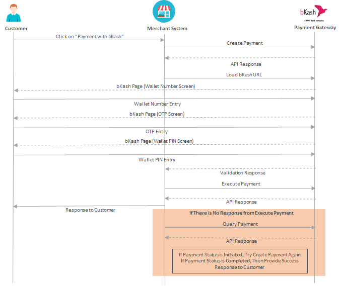

## The execution flow 

get_token() -> create_payment() -> execute_payment() . Just Call the get_token function. That is it.

## How to use it?
1. Get the necessary credentials first(The list is given below)
2. Create an app inside your Django project(Ex. Payment)
3. use the urls.py and views.py from this repo
4. Just call the get_token() function, it will guide you.
5. You should see the payment ui on your browser.

## System Execution Flow

## How does it work then?
As you can see the user needs to call Create_payment. It will automatically guide the user. But before you call Create_payment function you need to have a valid token. So, from views.py just call
the get_token function it will receive the token and automatically call the Create_payment function for you and leave everything to bkash. Their ui will guide the user to complete the payment.

## Don't Forget
1. Make sure you save the transaction history(Ex. you may need to refund). So, I have a Transaction table here.
2. make sure you set these following constants in settings.py. Once you open your merchant account, you will get these credentials.

BKASH_USERNAME = ''  
BKASH_PASSWORD = ''  
BKASH_APP_KEY = ''  
BKASH_SECRET_KEY = ''  
 
BKASH_TOKEN_URL = "https://tokenized.sandbox.bka.sh/v1.2.0-beta/tokenized/checkout/token/grant"
BKASH_CREATE_PAYMENT_URL =  "https://tokenized.sandbox.bka.sh/v1.2.0-beta/tokenized/checkout/create"
BKASH_EXECUTE_PAYMENT_URL = "https://tokenized.sandbox.bka.sh/v1.2.0-beta/tokenized/checkout/execute"
